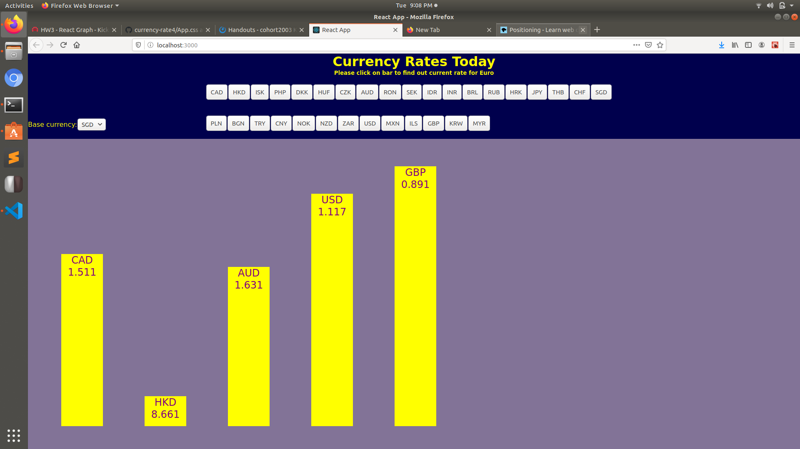

# React Currency Rates

It is a bar graph with of the currency rate from data fetched from the exchange rates API made using React. 

Components:

* Nav
* Dropdown
* Bars

API: https://api.exchangeratesapi.io/latest

Clicking on a currency abbreviation will generate a bar inside the bar container along with the default bars already inside. Also clicking on  an abbreviation existing will cause the bar to disappear.

Here is a screenshot of the bar graph in action.

Live Site: https://radiant-anchorage-16031.herokuapp.com/ 
